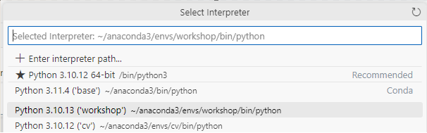
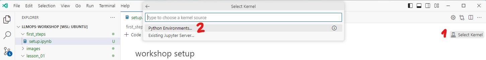

### VS Code Setup

In VS Code:

1. Install [Python](https://marketplace.visualstudio.com/items?itemName=ms-python.python)

2. Install [Azure Tools Extension](https://marketplace.visualstudio.com/items?itemName=ms-vscode.vscode-node-azure-pack)

3. Install [Semantic Kernel Tools](https://marketplace.visualstudio.com/items?itemName=ms-semantic-kernel.semantic-kernel)

4. In VS Code UI select the conda environment you created in the first steps.
```
Open the command palette by pressing Ctrl+Shift+P (or Cmd+Shift+P on macOS).
Type and select Python: Select Interpreter.
A list of discovered environments will be shown in the drop-down list. 
Select the Python environment named workspace.
```


<!-- 


2. First select the notebook Kernel to be the same of the conda environment you created in the README.md first steps.


<P>
 -->

