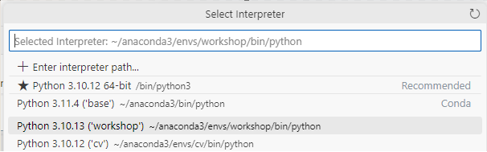

## Workshop Setup

1. Install the software mentioned in the pre-requisites session:

    <!-- - [Azure CLI](https://learn.microsoft.com/en-us/cli/azure/install-azure-cli) -->
    - [Anaconda](https://docs.conda.io/projects/conda/en/latest/user-guide/install/index.html)
    - [VS Code](https://code.visualstudio.com/)

2. Clone this repository to your local workstation.
```
    git clone git@github.com:placerda/sk-workshop.git  
```

3. Open terminal to create and activate conda environment
```
conda create -n sk-workshop python=3.10
conda activate sk-workshop
```

4. Open the directory where the repository was cloned in terminal.
```
    cd sk-workshop
```

5. Install the required python libraries.
```
    pip install -r requirements.txt
```

6. Add nbstripout filter to git to avoid saving notebooks output.
```
nbstripout --install
```

7. Open VS Code.
```
    code .
```

8. Download and Install VSCode Runtume[.NET Runtime](https://dotnet.microsoft.com/en-us/download)


9. VS Code Setup:

    9.1. In VS Code UI select the conda environment you created in step 3:
        
        9.1.1. Open the command palette by pressing Ctrl+Shift+P (or Cmd+Shift+P on macOS).

        9.1.2. Type and select Python: Select Interpreter.

        9.1.3. A list of discovered environments will be shown in the drop-down list.

        9.1.4. Select the Python environment named workshop.



    9.2. Optionally Install [Semantic Kernel Tools](https://marketplace.visualstudio.com/items?itemName=ms-semantic-kernel.semantic-kernel)

    Done! Workshop setup is finished.